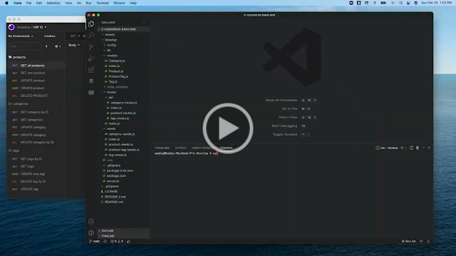

# e-commerce-back-end

This back-end application helps any e-commerce site keep track of their inventory by organizing all items into categories and add them to specific tags. You can also easily add new items, update them, or delete them.

**Link to Walkthrough Video**

https://drive.google.com/file/d/1yM8-lIQzngF7DR4rXXoUw7DiJrsvH0Hm/view?usp=sharing

